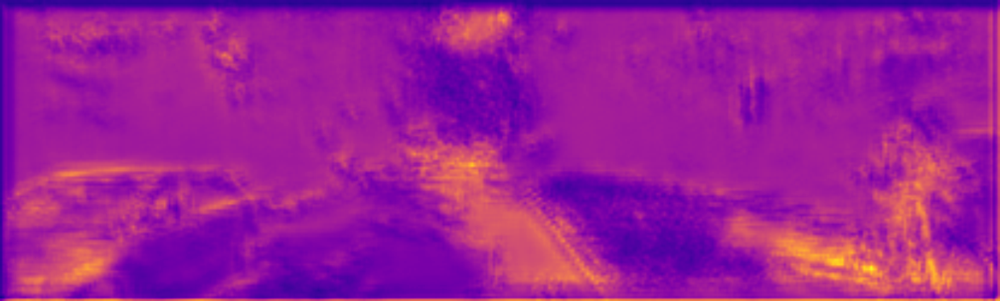
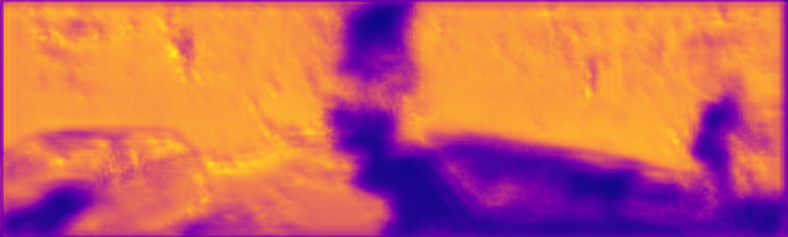
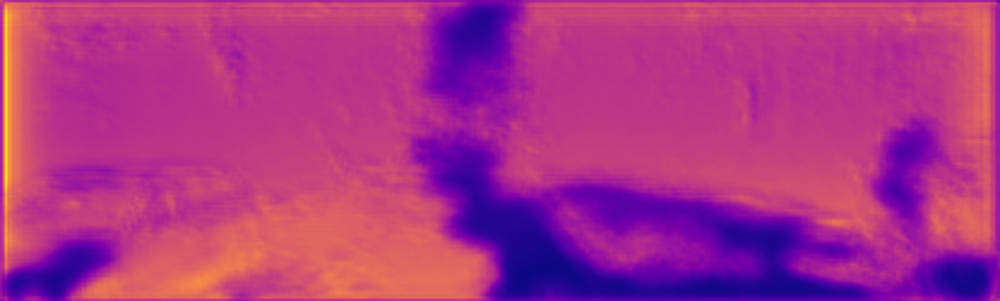
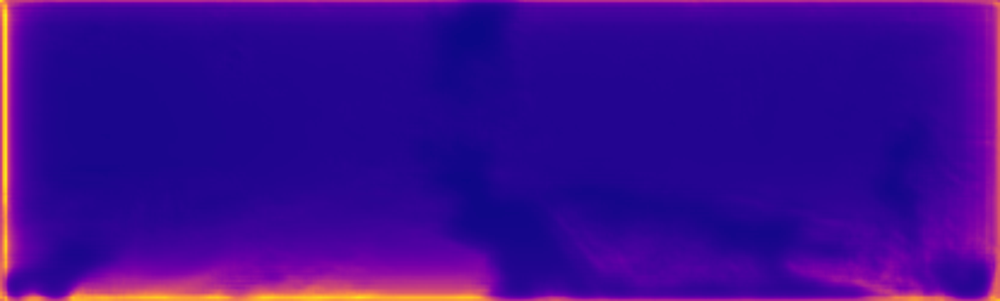
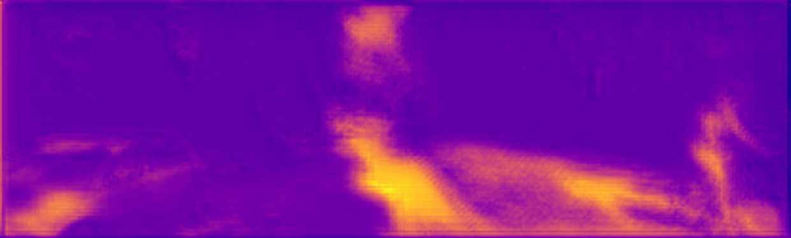
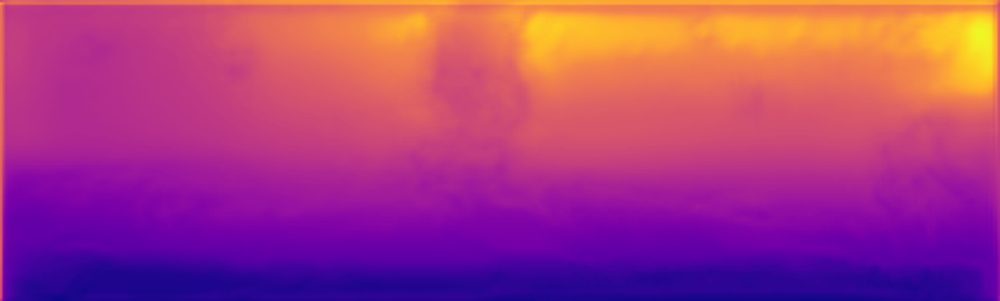
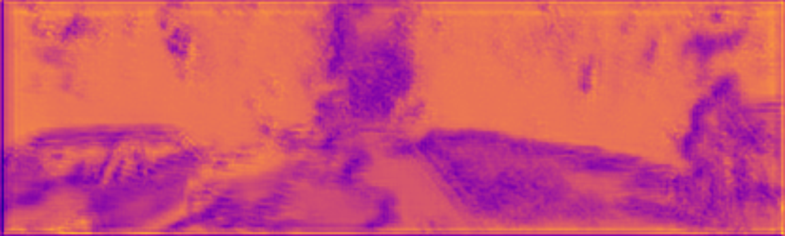

# GeoNet-Kitty
GeoNet在Kitty上的深度预测


### 1.DepthTask

记得先到Kitty_raw_loader里去改        

self.date_list = ['2011_09_26','2011_09_30'] #这里记录这要训练的数据集的地址

#### (1)数据预处理：  

我的代码是这样的 

> python data/prepare_train_data.py --dataset_dir=/home/hu/Common/GeoNet-Kitty/GeoNet/data/Data/kitty/ --dataset_name=kitti_raw_eigen --dump_root=/home/hu/Common/GeoNet-Kitty/GeoNet/data/Data/kitty_formate/ --seq_length=3 --img_height=128 --img_width=416 --num_threads=1 --remove_static


预处理的数据不能是在data/kitti/test_scenes.txt里的文件

如果出现多线程的错误 记得把 num_threads=16 改成1

如果出现找不到2011_09_26/calib_cam_to_cam.txt的文件 那说明你少下了一个 2011_09_26_calib的文件 这里记录了当天使用的相机的具体参数

#### (2)训练

> python geonet_main.py --mode=train_rigid --dataset_dir=/home/hu/Common/GeoNet-Kitty/GeoNet/data/Data/kitty_formate/ --checkpoint_dir=/home/hu/Common/GeoNet-Kitty/GeoNet/data/Data/save_ckpts/ --learning_rate=0.0002 --seq_length=3 --batch_size=4 --max_steps=11 --max_to_keep=2 --save_ckpt_freq=5


max_to_keep 是每多少步保存一次

他的代码geo_main.py里面缺了很多flags的声明

```python

flags.DEFINE_integer("num_source",                   2,   "His code loss this ")
flags.DEFINE_integer("num_scales",                   4,   "His code loss this ")
flags.DEFINE_string("add_flownet",                         "",    "His code loss this ")
flags.DEFINE_string("add_dispnet",                         "",    "His code loss this ")
flags.DEFINE_string("add_posenet",                         "",    "His code loss this ")

```

看这个issue：https://github.com/yzcjtr/GeoNet/pull/29

#### (3)测试

> python geonet_main.py --mode=test_depth --dataset_dir=/home/hu/Common/GeoNet-Kitty/GeoNet/data/Data/kitty/ --init_ckpt_file=/home/hu/Common/GeoNet-Kitty/GeoNet/data/Data/save_ckpts/model-10 --batch_size=1 --depth_test_split=eigen --output_dir=/home/hu/Common/GeoNet-Kitty/GeoNet/data/Data/output_prediect/


test集合要改test_file_**文件  我这里有个问题 不知道为什么测试集只能25张图  会报错说文件读取失败

好像是有些图片的后缀是jpg不是png所以错了  对，他的test_file_**文件里 清一色的写的全是png 但是实际上数据集有jpg的


> python kitti_eval/eval_depth.py --split=eigen --kitti_dir=/home/hu/Common/GeoNet-Kitty/GeoNet/data/Data/kitty/ --pred_file=/home/hu/Common/GeoNet-Kitty/GeoNet/data/Data/output_prediect/model-10.npy


10次

| abs_rel    | sq_rel   |  rms  |  log_rms |  d1_all   |  a1   |  a2   |   a3  |
| --------   | -----:  | -----:  |-----:  |-----:  |-----:  |-----:  |:----:  |
| 0.4311    | 3.7952   |  10.1014  |  0.5420 |  0.0000   |  0.3240   |  0.5889   |   0.7995  |


100次

| abs_rel    | sq_rel   |  rms  |  log_rms |  d1_all   |  a1   |  a2   |   a3  |
| --------   | -----:  | -----:  |-----:  |-----:  |-----:  |-----:  |:----:  |
| 0.5643    | 5.6149  |  10.6785  |  0.6139 |  0.0000   |  0.2838  |  0.5049   |   0.6932 |
 

900次 

| abs_rel    | sq_rel   |  rms  |  log_rms |  d1_all   |  a1   |  a2   |   a3  |
| --------   | -----:  | -----:  |-----:  |-----:  |-----:  |-----:  |:----:  |
| 0.3272    | 2.7901  |  9.4243  |  0.4586 |  0.0000   |  0.4378  |  0.7180   |   0.8610 |


50000次

| abs_rel    | sq_rel   |  rms  |  log_rms |  d1_all   |  a1   |  a2   |   a3  |
| --------   | -----:  | -----:  |-----:  |-----:  |-----:  |-----:  |:----:  |
| 0.2657    | 1.7861   |  6.3602  |  0.3222 |  0.0000   |  0.4859   |  0.8533   |   0.9615  |


GEOnet代码没有提供展示一张视差图结果图的方法 参考monodepth源码的monodepth——simple.py代码发现
在geonet_test_depth.py添加

```python

        disp_to_img = scipy.misc.imresize(pred_all[0].squeeze(), [opt.img_height, opt.img_width])
    	plt.imsave(os.path.join(opt.output_dir, "{}_disp.png".format("test")), disp_to_img, cmap='plasma')

```
即可展示出视差

#### 初步结果

#### 原图：


#### 10次



#### 25次




#### 50次




#### 75次



#### 100次



#### 500次


#### 900次



#### 50000次


### 2.加入PoseTask


PoseNet与GeoNet并行训练

如果没有PoseNet数据 则只有Geonet单独训练

如果没有GeoNet数据 则只有PoseNet单独训练

因此将处理好的PoseNet数据和GeoNet数据要放在一起，一同训练


(1)数据预处理

> python data/prepare_train_data.py --dataset_dir=/home/hu/Common/GeoNet-Kitty/GeoNet/data/Data/kitty/ --dataset_name=kitti_odom --dump_root=/home/hu/Common/GeoNet-Kitty/GeoNet/data/Data/kitty_formate/ --seq_length=5 --img_height=128 --img_width=416 --num_threads=1 --remove_static

我的sequences的数据集在kitty文件夹下 

dataset_dir 里不要有sequences

(2)训练

> python geonet_main.py --mode=train_rigid --dataset_dir=/home/hu/Common/GeoNet-Kitty/GeoNet/data/Data/kitty_formate/ --checkpoint_dir=/home/hu/Common/GeoNet-Kitty/GeoNet/data/Data/save_ckpts/ --learning_rate=0.0002 --seq_length=3 --batch_size=4 --max_steps=11 --max_to_keep=2 --save_ckpt_freq=5

(3)测试PoseNet

1.生成Predict的snippets
> python geonet_main.py --mode=test_pose --dataset_dir=/home/hu/Common/GeoNet-Kitty/GeoNet/data/Data/kitty/ --init_ckpt_file=/home/hu/Common/GeoNet-Kitty/GeoNet/data/Data/save_ckpts/model-10 --batch_size=1 --seq_length=3 --pose_test_seq=4 --output_dir=/home/hu/Common/GeoNet-Kitty/GeoNet/data/Data/output_prediect/

--pose_test_seq  是选择测试的数据集


seq_length为什么为5就失败了？

2.用data_odometry_poses.zip 数据集生成Snippets generate the groundtruth pose snippets

> python kitti_eval/generate_pose_snippets.py --dataset_dir=/home/hu/Common/GeoNet-Kitty/GeoNet/data/Data/kitty/ --output_dir=/home/hu/Common/GeoNet-Kitty/GeoNet/data/Data/OutputSnippets/ --seq_id=04 --seq_length=3

测试集合还需要data_odometry_poses.zip 数据集 也就是ground truth数据集
不然会出现IOError: [Errno 2] No such file or directory: '/home/hu/Common/GeoNet-Kitty/GeoNet/data/Data/kitty/poses/04.txt' 错误

3.将预测的 snippets  与   数据集生成Snippets generate the groundtruth pose snippets对比

> python kitti_eval/eval_pose.py --gtruth_dir=/home/hu/Common/GeoNet-Kitty/GeoNet/data/Data/OutputSnippets/ --pred_dir=/home/hu/Common/GeoNet-Kitty/GeoNet/data/Data/output_prediect/

结果得到均值与方差

Predictions dir: /home/hu/Common/GeoNet-Kitty/GeoNet/data/Data/output_prediect/
ATE mean: 0.9986, std: 0.0985


#### 10次



